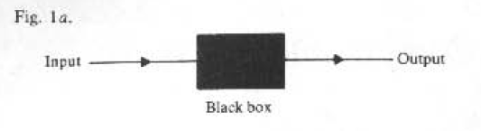

# Computable Functions

NB: This document provides an overview to the first 4 chapters from _An Introduction
To Recursive Function Theory_. Helpful links are inlined throughout. If you see any
errors, feel free to open an issue or PR to report or fix them.

---

## Algorithms or Effective Procedures

Algorithms can be represented as shown in fig. 1a.



**Input**: the raw data or object for the operation to perform actions on

**Output**: mechanically produced by the black box (thought of as a calculating machine, computer, etc.)

When an algorithm is used to calculate the values of a numerical function then the function in question can be described as _effectively calculable_, _algorithmmically computable_, or just straight up _computable_.

### Example 1

```
g(n) = 1

if there is a run of exactly *n* consecutive 7s in the decimal expansion of pi

g(n) = 0 otherwise.
```

_g_ would be a perfectly legitimate function, but the issue with _g_ is that if for a particular _n_ there is no sequence of exactly _n_ consecutive 7s, then there's no stage in which we can reach a conclusion. The sequence of 7s can appear at any part of the expansion of pi. Thus, the 'procedure' goes on forever so it's not an _effective_ procedure.

Example 1 captures the two main features implicit in the idea of an effective procedure.

1.  A procedure is carried out in a sequence of stages/steps  
    (each completed in finite time)

2.  Any output should emerge after a finite amount of steps

## Unlimited Register Machines (URMs)

Any real computer is limited both in size of numbers it can receive, and the amount of working space available; due to this we'll be using the informal idea of a mathematical idealised computer to work with the concept of an algorithm.

Here are the following properties of an Unlimited Register Machine:

1. Programs for our machine will be finite

2. Require that a completed computation takes only a finite amount number of steps

3. Inputs and outputs are restricted to natural numbers

   > Not a significant restriction, since operations involving other kinds of objects can be coded as operations on natural numbers

4. Has an infinite number of registers labelled R1, R2, R3, ... each of which at any moment contains a natural number

5. Contents of the registers may be altered by the URM in response to certain _instructions_

   > Instructions correspond to very simple operations useed in performing calculations with numbers.

A finite list of instructions constitues a _program_. The instructions are of 4 kinds as follows:

1. **Zero** _Z(i)_ 1 <= i <= r, assigns 0 to register; Ri: Ri <- 0

2. **Sum** _S(i)_, 1 <= i <= r, increments by 1 the value stored in; Ri: Ri <- Ri + 1

3. **Transfer** _T(i,j)_, 1 <= i, j <= r, assigns to R the value stored in; Ri: Rj <- Ri

4. **Jump** _J(i,j,k)_, 1 <= i, j <= r, 1 <= k <= s, has the effect of setting pc to k in case Ri & Rj store the same integer. Otherwise program counter (pc) is incremented by 1.
